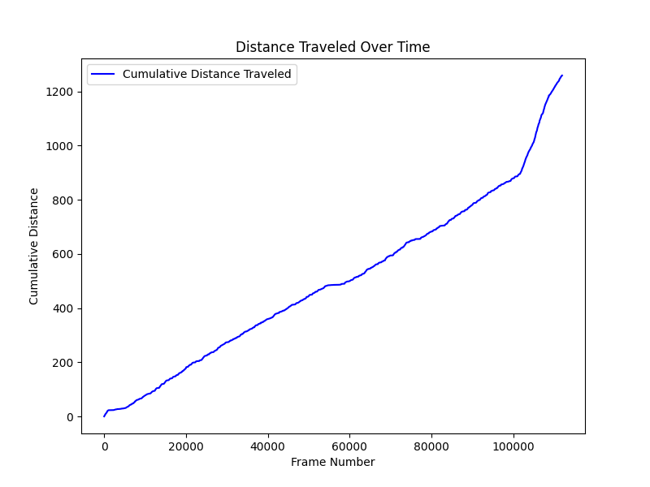
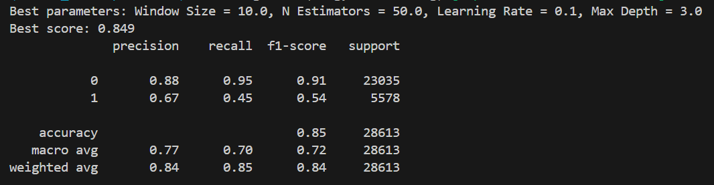
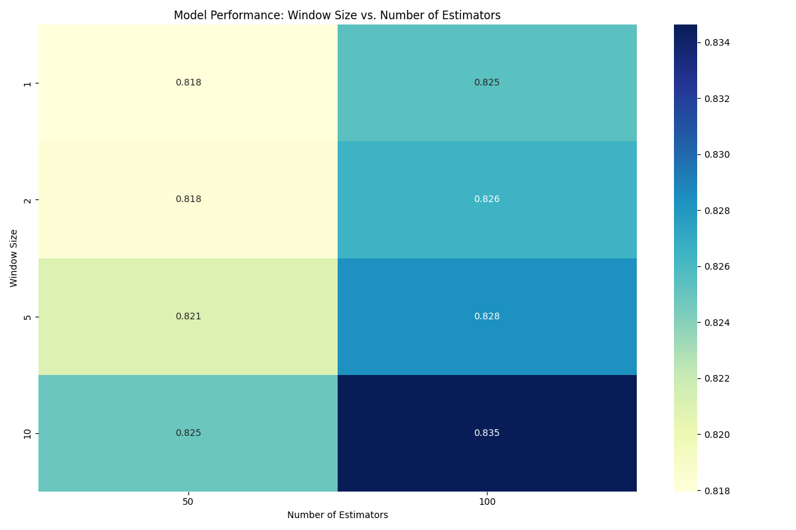
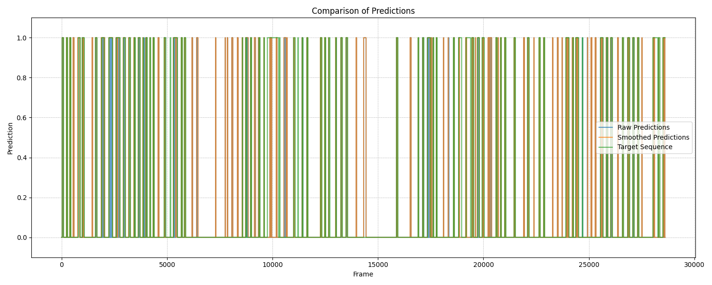

# Highlight Reel Video 

### Hello!! Welcome to the Highlight Reel Video Project. This Project is about creating an highlight reel that will be a short but an informative video of the larger video that includes all the important moments fromthe main video with preprocessing and feature engineering. It utilizes a combination of trajectory analysis, machine learning classification, and video processing to generate engaging highlights from match footage. This system streamlines the workflow for analysts, coaches, and content creators by automating event detection and video production.


This is the Link to the video. Click to watch the Highlight Reel of the Volleyball match 
##  [](https://youtu.be/YOlFYVxnS3Q?si=r3UQ4Zk4bFgEERsU)

---

## Requirements are as follows:
Before running the project, ensure that you have the following dependencies installed:
Python 3.7+ , opencv-python, numpy, pandas, scikit-learn, matplotlib, scipy

---

## The project is divided into several stages:

1. **Data Analysis and Feature Engineering:** Perform data cleaning and derive additional features using scripts like data_analysis.py.
Animate ball trajectories using animation.py.
2. **Model Training and Prediction:** Train a classification model using Time_Classification1.py.
Visualize model predictions with visualize_target.py.
3. **Prediction Smoothing:** Smooth raw predictions using techniques like moving averages, Gaussian filters, and expansion (handled in filter_predictions.py).
4. **Highlight Generation:** Generate highlights from smoothed predictions, with seamless transitions applied to key events (video_transition.py).
5. **Final Output and Evaluation:** Save results and visualize comparisons between raw, smoothed predictions, and ground truth data.

- *Feature-Rich Analysis:* Extract meaningful features such as distance travelled, angle change.
- *Advanced Smoothing:* Techniques like median, Gaussian, and moving average filters ensure stable event detection.
- *Highlight Transitions:* High-quality transitions, including fade, slide, and dissolve effects, for professional output.
- *Customizable Parameters:* User-configurable settings for model tuning, smoothing window size, and transition effects.

---

## Structure of the project files:

Video Highlight Reel Generating:

data: Contains raw data and videos
i) Input video file
   video.mp4                 
ii) Raw trajectory data
    provided_data.csv         
iii) Classification target data
     target.csv               

scripts: Python scripts for different stages
--> data_preprocessing: Data collection and preprocessing
     i) Initial data cleaning and visualization
        data_analysis.py             
     ii) Adding custom features
         data_analysis_features.py   
     iii) Visualize custom features with ball tracking
          animation.py               
     iv) Results generated by data preprocessing scripts
         results                      
--> model_training: Model selection and training
     i) Train XGboost classifier
        Time_Classification1.py     
     ii) Visualize model predictions on video
         visualize_target.py        
     iii) Results generated by data preprocessing scripts
          results                    
   
---> video_processing: Video smoothing and transitions
     i) Apply advanced filtering techniques
        filter_predictions.py   
     ii) Highlight generation with OpenCV
         opencv_intro.py         
     iii) Apply transitions between video segments
          video_transition.py    
     iv) Results generated by data preprocessing scripts 
         results
            
results: Output files
i) Smoothed model predictions:
   smoothed_predictions.csv           
ii) Video without transitions
    output_video.mp4                  
iii) Video with transitions
     highlight_reel_transitions.mp4

Project dependencies:
 requirements.txt  

---

## Steps to Install
Clone the repository:
   ```bash
   git clone https://github.com/AkshadaRanalkar/Highlight_Reel_Generation
   cd volleyball-highlight-system
   ```
Create and activate a virtual environment:
   ```bash
   python -m venv venv
   source venv/bin/activate  # On Windows: venv\Scripts\activate
   ```
Install the required libraries:
   ```bash
   pip install -r requirements.txt
   ```
Ensure video and data files are located in the data/ folder.  
---

## Usage
1. Preprocess and Visualize Data:

- **Clean and analyze match data:**
    ```bash
    python data_preprocessing/data_analysis.py
    ```
- **Feature Engineering:**
    ```bash
    python data_preprocessing/data_analysis_custom_feature.py
    ```
 Add custom derivative features such as "time spent in region" with data_analysis_custom_feature.py: 
- **Animate ball trajectories in the match video:**
    ```bash
    python data_preprocessing/animation.py
    ```
2. Train Classification Model
- **Train the classifier to predict key match events:**
    ```bash
    python model_training/Time_Classification1.py
    ```
- **Visualize predictions:**
    ```bash
    python model_training/visualize_target.py
    ``` 
3. Smooth Predictions
- **Apply smoothing techniques to reduce noise in predictions:**
  ```bash
       python video_processing/filter_predictions.py
   ``` 
4. Highlight Generation:
   - **Once the model is trained, run the opencv_intro script to create the highlights from a video:**
        ```bash
       python video_processing/opencv_intro.py tracking_visualization.mp4 --csv smoothed_predictions.csv --resize 1280 720
       ``` 
5. Video Transition:
   - **Produce highlights with transitions:**
     ```bash
      python video_processing/video_prediction.py
     ``` 
---

## Model Processing Details

Model Overview:

1. **Classifier:** 
   - XGBoost (eXtreme Gradient Boosting). Multiple models have been run and the accuracy has been compared to get the best model.
     
2. **Feature Engineering:** 
   - Features such as distance travelled, angle change has been incorporated

## Smoothing

- **Techniques:** Applies advanced techniques such as Median filtering, Gaussian smoothing, and moving average to stabilize predictions.
- **Implementation:** Configured through filter_predictions.py using the PredictionProcessor class, which applies the best-suited smoothing techniques.

## Transitions

- **Effect Types:** Includes effects like fade, slide, and dissolve to create visually appealing transitions between key moments.
- **Implementation:** Handled in video_transition.py using OpenCV's advanced blending techniques.

---


## Results

1. **Feature**:
   - Distance Travelled: Tells how much distance the ball hav covered with respect to time.
   - Angle Change: The angle change feature measures the change in direction between consecutive points. It can help analyze motion dynamics, such as:Identifying turns or changes in trajectory, understanding directional patterns in movement, detecting anomalies or irregularities in motion paths.
     <div style="margin-top: 20px; display: flex; justify-content: center; gap: 20px; margin-bottom: 20px">
        
        
     </div>
     
2. **Model Performance**:
   - The XGboost classifier was trained and validated with various feature sets, yielding impressive classification accuracy. Hyperparameter optimization improved the **weighted F1 score**, making the model more reliable for detecting key events in the game. below is the result from the classification report

     <div style="margin-top: 20px; display: flex; justify-content: center; gap: 20px; margin-bottom: 20px">
        
        
     </div>

3. **Prediction Smoothing:**
   - The system generates smoothed predictions by comparing raw predictions with the ground truth targets. The results are visualized.
     
    <div style="margin-top: 20px; display: flex; justify-content: center; gap: 20px; margin-bottom: 20px">
        
    </div>
   
4. **Highlight Video:**
   - Highlights with smooth transitions are saved. Transition effects like fade, slide, and dissolve enhance the presentation quality of the video.

5. **Video Transition Details**
   - The video transitions were visually appealing, adding a professional touch to the highlight reel.
   - Transitions: Transitions between highlights are generated using OpenCV.
   - Fade: Gradual blending of two frames to create a smooth effect.
   - Slide: Left-to-right or right-to-left frame transitions for a dynamic effect.
   - Dissolve: Pixel-level blending based on randomized masking to create a seamless transition.
   - [Watch the Full Video Highlight on YouTube](https://youtu.be/YOlFYVxnS3Q?si=IVNFbEKPjGHvNNZs)

---
